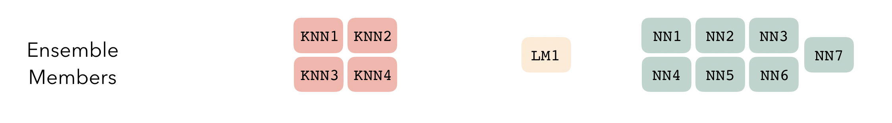
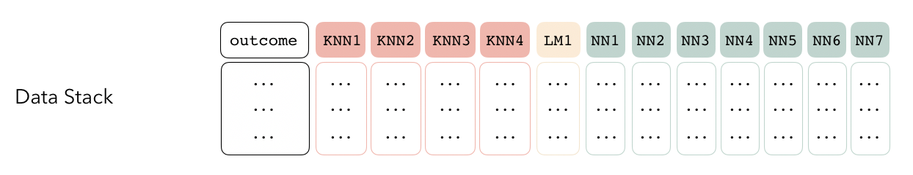
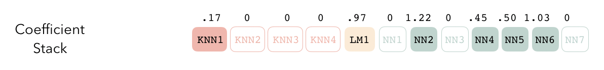
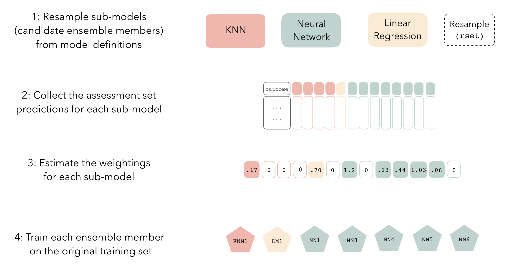
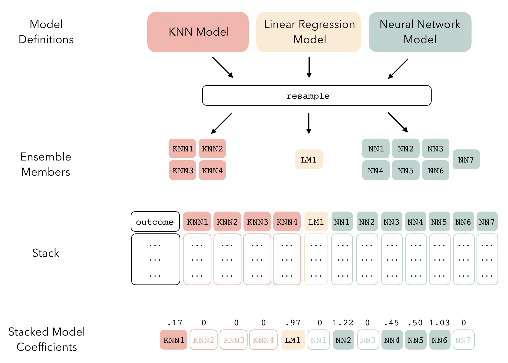

<!-- [](https://codecov.io/gh/simonpcouch/stacks?branch=main)  -->
<!-- [](https://github.com/simonpcouch/stacks/actions) -->

```{r setup, include=FALSE}
knitr::opts_chunk$set(echo = TRUE)
```

# stacks - tidy model stacking

stacks is an R package for model stacking that aligns with the tidymodels. Model stacking is an ensembling method that takes the outputs of many models and combines them to generate a new model—referred to as an _ensemble_ in this package—that generates predictions informed by each of its _members_.

At the highest level, ensembles are formed from _model definitions_. In this package, model definitions are an instance of a _model specification_, as defined in the [parsnip](https://parsnip.tidymodels.org/) package.


To be used in the same ensemble, each of these model definitions must share the same _resample_. This [rsample](https://rsample.tidymodels.org/) `rset` object, when paired with the model definitions, can be used to generate the candidate _ensemble members_.



The package will sometimes refer to _sub-models_. The difference between sub-models and ensemble members is mostly philosophical—an ensemble member is a sub-model that has actually been selected and trained for use in the ensemble (via nonzero stacking coefficients) that is not regarded as resulting from a specific model definition, where-as a sub-model is an untrained candidate ensemble member.

Sub-models first come together in a _data stack_. Principally, these objects are just [tibbles](https://tibble.tidyverse.org/), where the first column gives the true outcome in the assessment set, and the remaining columns give the predictions from each candidate ensemble member. (When the outcome is numeric, there's only one column per ensemble member. Multi-way classification requires more columns.) They also bring along a few extra attributes to keep track of model definitions.



Finally, the data stack can be fitted—depending on the arguments you choose, the structure of the model can vary quite a bit. A few things to keep in mind, though:  

* The fitting process is not sensitive to model definition membership. That is, while fitting an ensemble from a stack, the components are referred to as ensemble members rather than sub-models.  
* The outputs of each member are likely highly correlated. Thus, depending on the degree of regularization you choose, the coefficients for the inputs of (possibly) many of the members will zero out—their predictions will have no influence on the final output, and those terms will thus be thrown out.



These stacking coefficients, along with the trained ensemble members, make up the fit, which can be used to predict new values!

At a high level, the process follows these steps:



With a bit more detail:



## Contributing

This project is released with a [Contributor Code of Conduct](CODE_OF_CONDUCT.md). By contributing to this project, you agree to abide by its terms.

- For questions and discussions about tidymodels packages, modeling, and machine learning, please [post on RStudio Community](https://rstd.io/tidymodels-community).

- If you think you have encountered a bug, please [submit an issue](https://github.com/tidymodels/stacks/issues).

- Either way, learn how to create and share a [reprex](https://rstd.io/reprex) (a minimal, reproducible example), to clearly communicate about your code.

- Check out further details on [contributing guidelines for tidymodels packages](https://www.tidymodels.org/contribute/) and [how to get help](https://www.tidymodels.org/help/).
