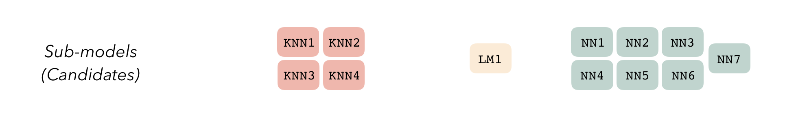
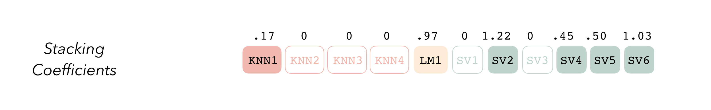
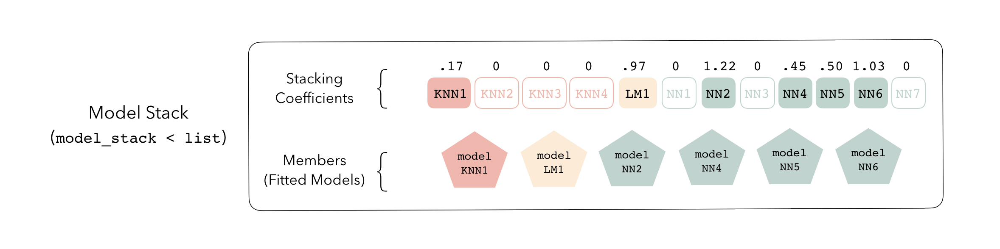
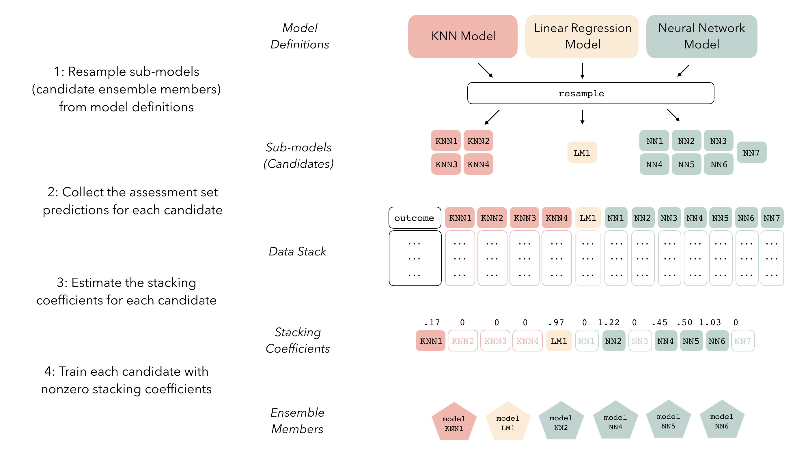

<!-- badges: start -->
[](https://github.com/simonpcouch/stacks/actions)
[](https://codecov.io/gh/tidymodels/stacks?branch=main)
[](https://CRAN.R-project.org/package=stacks)
[](https://www.tidyverse.org/lifecycle/#experimental)
[](https://github.com/tidymodels/stacks/actions)
<!-- badges: end -->

```{r setup, include=FALSE}
knitr::opts_chunk$set(echo = TRUE)
```

## stacks - tidy model stacking

stacks is an R package for model stacking that aligns with the tidymodels. Model stacking is an ensembling method that takes the outputs of many models and combines them to generate a new model—referred to as an _ensemble_ in this package—that generates predictions informed by each of its _members_.

The process goes something like this:

1. Define candidate ensemble members using functionality from [rsample](https://rsample.tidymodels.org/), [parsnip](https://parsnip.tidymodels.org/), [workflows](https://workflows.tidymodels.org/), [recipes](https://recipes.tidymodels.org/), and [tune](http://tune.tidymodels.org/)
2. Initialize a `data_stack` object with `stacks()`  
3. Iteratively add candidate ensemble members to the `data_stack` with `add_candidates()`  
4. Evaluate how to combine their predictions with `blend_predictions()`  
5. Fit candidate ensemble members with non-zero stacking coefficients with `fit_members()`  
6. Predict on new data with `predict()`

You can install the (unstable) development version of this package with the following code!

```{r, eval = FALSE}
remotes::install_github("tidymodels/stacks", ref = "main")
```

Rather than diving right into the implementation, we'll focus here on how the pieces fit together, conceptually, in building an ensemble with `stacks`. See the `basics` vignette for an example of the API in action!

## a grammar

At the highest level, ensembles are formed from _model definitions_. In this package, model definitions are an instance of a minimal workflow, containing a _model specification_ (as defined in the parsnip package) and, optionally, a _preprocessor_ (as defined in the recipes package). Model definitions specify the form of candidate ensemble members.


To be used in the same ensemble, each of these model definitions must share the same _resample_. This rsample `rset` object, when paired with the model definitions, can be used to generate the tuning/fitting results objects for the candidate _ensemble members_ with tune.



The package will sometimes refer to _sub-models_. An ensemble member is a sub-model that has actually been selected (and possibly trained) for use in the ensemble (via nonzero stacking coefficients, usually) that is not regarded as resulting from a specific model definition, where-as a sub-model is an untrained candidate ensemble member.

Sub-models first come together in a `data_stack` object through the `add_candidates()` function. Principally, these objects are just [tibbles](https://tibble.tidyverse.org/), where the first column gives the true outcome in the assessment set, and the remaining columns give the predictions from each candidate ensemble member. (When the outcome is numeric, there's only one column per candidate ensemble member. Classification requires as many columns per candidate as there are levels in the outcome variable.) They also bring along a few extra attributes to keep track of model definitions.


Then, the data stack can be evaluated using `blend_predictions()` to determine to how best to combine the outputs from each of the candidate member models.  

Note that the fitting process is not sensitive to model definition membership. That is, while fitting an ensemble from a stack, the components are regarded as candidate ensemble members rather than as sub-models.   

The outputs of each member are likely highly correlated. Thus, depending on the degree of regularization you choose, the coefficients for the inputs of (possibly) many of the members will zero out—their predictions will have no influence on the final output, and those terms will thus be thrown out.  



These stacking coefficients decide then which sub-models will be ensemble members—sub-models with non-zero stacking coefficients are then fitted, altogether making up a `model_stack` object.



This model stack object, outputted from `fit_members()`, is ready to predict on new data!

At a high level, the process follows these steps:



The API for the package closely mirrors these ideas. See the `basics` vignette for an example of how this grammar is implemented!

## contributing

This project is released with a [Contributor Code of Conduct](CODE_OF_CONDUCT.md). By contributing to this project, you agree to abide by its terms.

- For questions and discussions about tidymodels packages, modeling, and machine learning, please [post on RStudio Community](https://rstd.io/tidymodels-community).

- If you think you have encountered a bug, please [submit an issue](https://github.com/tidymodels/stacks/issues).

- Either way, learn how to create and share a [reprex](https://rstd.io/reprex) (a minimal, reproducible example), to clearly communicate about your code.

- Check out further details on [contributing guidelines for tidymodels packages](https://www.tidymodels.org/contribute/) and [how to get help](https://www.tidymodels.org/help/).
