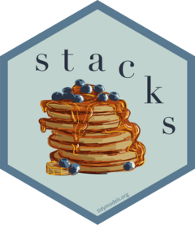

<!-- badges: start -->
[](https://doi.org/10.21105/joss.04471)
[](https://github.com/tidymodels/stacks/actions)
[](https://CRAN.R-project.org/package=stacks)
<!-- badges: end -->

```{r setup, include=FALSE}
knitr::opts_chunk$set(echo = TRUE)
```

## stacks - tidy model stacking <a href='https://stacks.tidymodels.org'></a>

stacks is an R package for model stacking that aligns with the tidymodels. Model stacking is an ensembling method that takes the outputs of many models and combines them to generate a new model—referred to as an _ensemble_ in this package—that generates predictions informed by each of its _members_.

The process goes something like this:

1. Define candidate ensemble members using functionality from [rsample](https://rsample.tidymodels.org/), [parsnip](https://parsnip.tidymodels.org/), [workflows](https://workflows.tidymodels.org/), [recipes](https://recipes.tidymodels.org/), and [tune](https://tune.tidymodels.org/)
2. Initialize a `data_stack` object with `stacks()`  
3. Iteratively add candidate ensemble members to the `data_stack` with `add_candidates()`  
4. Evaluate how to combine their predictions with `blend_predictions()`  
5. Fit candidate ensemble members with non-zero stacking coefficients with `fit_members()`  
6. Predict on new data with `predict()`

You can install the  package with the following code:

```{r, eval = FALSE}
install.packages("stacks")
```

Install the development version with:

```{r, eval = FALSE}
# install.packages("pak")
pak::pak("tidymodels/stacks")
```

stacks is generalized with respect to:

* Model type: Any model type implemented in [parsnip](https://parsnip.tidymodels.org/) or extension packages is fair game to add to a stacks model stack. [Here](https://www.tidymodels.org/find/parsnip/)'s a table of many of the implemented model types in the tidymodels core, with a link there to an article about implementing your own model classes as well.
* Cross-validation scheme: Any resampling algorithm implemented in [rsample](https://rsample.tidymodels.org/) or extension packages is fair game for resampling data for use in training a model stack.
* Error metric: Any metric function implemented in [yardstick](https://yardstick.tidymodels.org/) or extension packages is fair game for evaluating model stacks and their members. That package provides some infrastructure for creating your own metric functions as well!

stacks uses a regularized linear model to combine predictions from ensemble members, though this model type is only one of many possible learning algorithms that could be used to fit a stacked ensemble model. For implementations of additional ensemble learning algorithms, check out [h2o](https://docs.h2o.ai/h2o/latest-stable/h2o-r/docs/reference/h2o.stackedEnsemble.html) and [SuperLearner](https://CRAN.R-project.org/package=SuperLearner).

Rather than diving right into the implementation, we'll focus here on how the pieces fit together, conceptually, in building an ensemble with `stacks`. See the `basics` vignette for an example of the API in action!

## a grammar

At the highest level, ensembles are formed from _model definitions_. In this package, model definitions are an instance of a minimal [workflow](https://workflows.tidymodels.org/), containing a _model specification_ (as defined in the [parsnip](https://parsnip.tidymodels.org/) package) and, optionally, a _preprocessor_ (as defined in the [recipes](https://recipes.tidymodels.org/) package). Model definitions specify the form of candidate ensemble members.


To be used in the same ensemble, each of these model definitions must share the same _resample_. This [rsample](https://rsample.tidymodels.org/) `rset` object, when paired with the model definitions, can be used to generate the tuning/fitting results objects for the candidate _ensemble members_ with tune.


Candidate members first come together in a `data_stack` object through the `add_candidates()` function. Principally, these objects are just [tibble](https://tibble.tidyverse.org/)s, where the first column gives the true outcome in the assessment set (the portion of the training set used for model validation), and the remaining columns give the predictions from each candidate ensemble member. (When the outcome is numeric, there's only one column per candidate ensemble member. Classification requires as many columns per candidate as there are levels in the outcome variable.) They also bring along a few extra attributes to keep track of model definitions.


Then, the data stack can be evaluated using `blend_predictions()` to determine to how best to combine the outputs from each of the candidate members.  In the stacking literature, this process is commonly called _metalearning_.

The outputs of each member are likely highly correlated. Thus, depending on the degree of regularization you choose, the coefficients for the inputs of (possibly) many of the members will zero out—their predictions will have no influence on the final output, and those terms will thus be thrown out.  


These stacking coefficients determine which candidate ensemble members will become ensemble members. Candidates with non-zero stacking coefficients are then fitted on the whole training set, altogether making up a `model_stack` object. 


This model stack object, outputted from `fit_members()`, is ready to predict on new data! The trained ensemble members are often referred to as _base models_ in the stacking literature.

The full visual outline for these steps can be found [here](https://github.com/tidymodels/stacks/blob/main/inst/figs/outline.png). The API for the package closely mirrors these ideas. See the `basics` vignette for an example of how this grammar is implemented!

## contributing

This project is released with a [Contributor Code of Conduct](https://github.com/tidymodels/stacks/blob/main/.github/CODE_OF_CONDUCT.md). By contributing to this project, you agree to abide by its terms.

- For questions and discussions about tidymodels packages, modeling, and machine learning, please [post on Posit Community](https://forum.posit.co/new-topic?category_id=15&tags=tidymodels,question).

- If you think you have encountered a bug, please [submit an issue](https://github.com/tidymodels/stacks/issues).

- Either way, learn how to create and share a [reprex](https://reprex.tidyverse.org/articles/learn-reprex.html) (a minimal, reproducible example), to clearly communicate about your code.

- Check out further details on [contributing guidelines for tidymodels packages](https://www.tidymodels.org/contribute/) and [how to get help](https://www.tidymodels.org/help/).

In the stacks package, some test objects take too long to build with every commit. If your contribution changes the structure of `data_stack` or `model_stacks` objects, please regenerate these test objects by running the scripts in `man-roxygen/example_models.Rmd`, including those with chunk options `eval = FALSE`.
