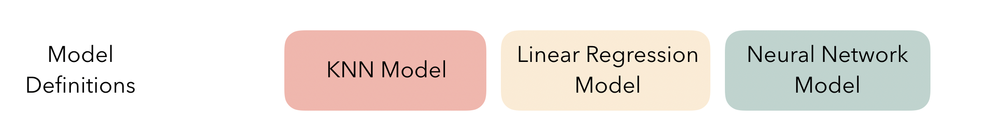
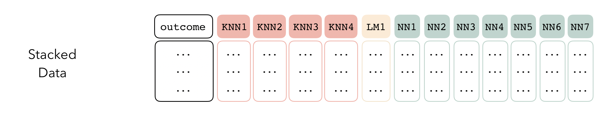
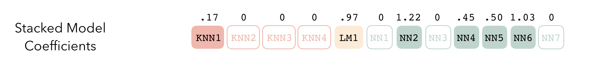

<!--   -->

<!--  -->

# pancakes - tidy model stacking

pancakes is an R package for model stacking that aligns with the
tidymodels. Model stacking is an ensembling method that takes the
outputs of many models and combines them to generate a new
model—referred to as an *ensemble* in this package—that generates
predictions informed by each of its *members*.

At the highest level, ensembles are formed from *model definitions*. In
this package, model definitions are an instance of a *model
specification*, as defined in the
[parsnip](https://parsnip.tidymodels.org/) package.

To be used in the same ensemble, each of these model definitions must
share the same *resample*. This
[rsample](https://rsample.tidymodels.org/) `rset` object, when paired
with the model definitions, can be used to generate the *ensemble
members*.

The package will sometimes refer to *sub-models*. The difference between
sub-models and ensemble members is only philosophical—a sub-model is an
ensemble member when it’s membership as an element of a model definition
is disregarded, and an ensemble member is a sub-model when it is
regarded as resulting from a specific model definition.

In this package, ensemble members come together in a *stack*.
Principally, `stack` objects are just
[tibbles](https://tibble.tidyverse.org/), where the first row gives the
true outcome, and the remaining rows give the out-of-sample-predictions
from each ensemble member. (When the outcome is numeric, there’s only
one column per ensemble member. Multi-way classification requires more
columns.) They also bring along a few extra attributes to keep track of
model definitions.

Finally, the stack can be fitted—depending on the arguments you choose,
the structure of the model can vary quite a bit. A few things to keep in
mind, though: \* The fitting process is not sensitive to model
definition membership. That is, while fitting an ensemble from a stack,
the components are referred to as ensemble members rather than
sub-models. \* The outputs of each member are likely highly correlated.
Thus, depending on the degree of regularization you choose, the
coefficients for the inputs of (possibly) many of the members will zero
out—their predictions will have no influence on the final output, and
those terms will thus be thrown out.

The coefficients make up the fit, which can be used to predict new
values\!

Altogether, the pieces fit together like this:

